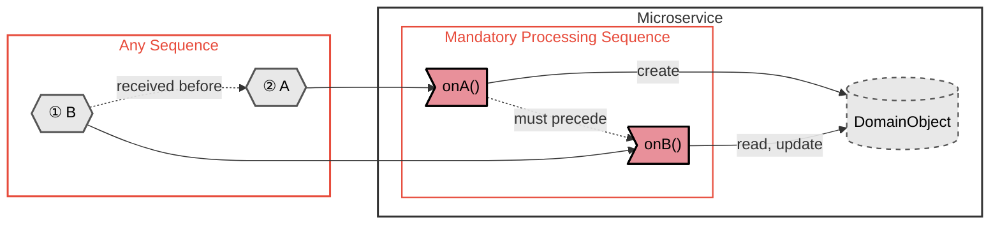
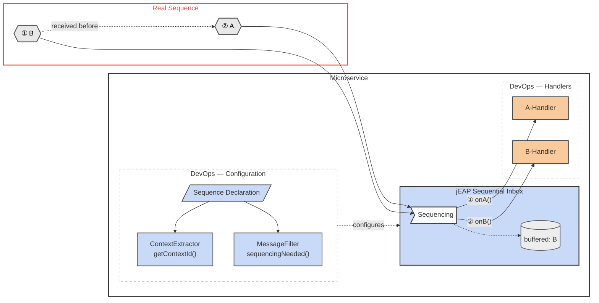
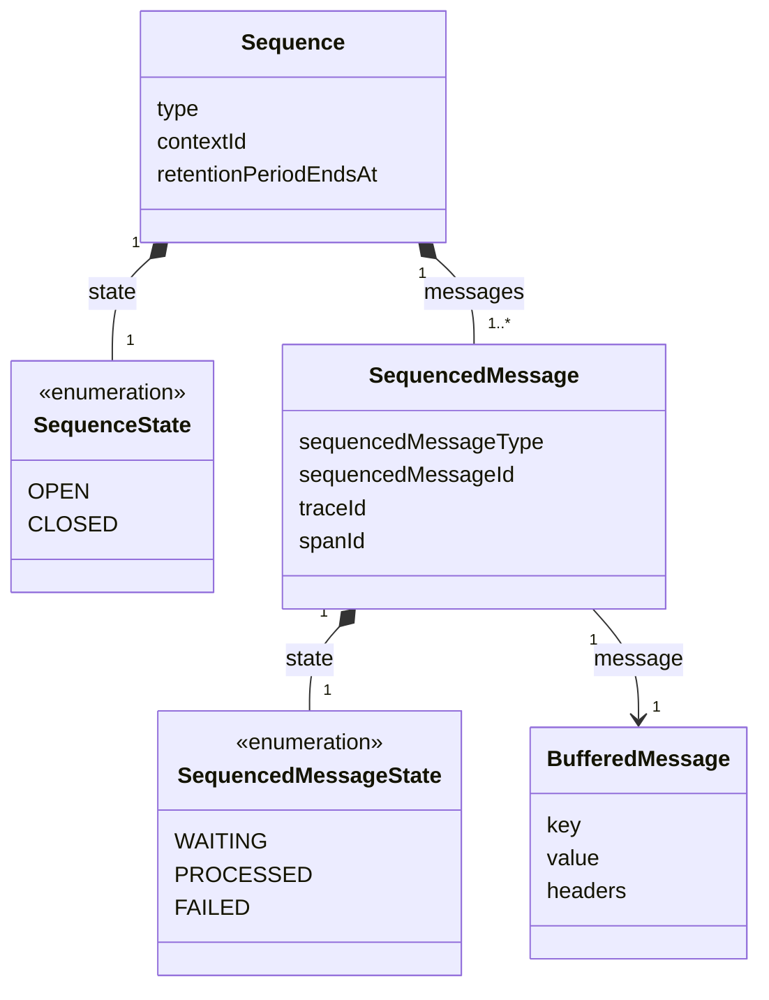
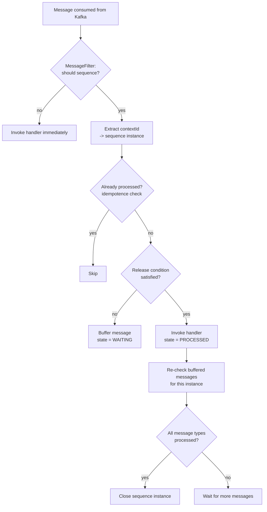

# How sequencing works

The Sequential Inbox consumes Kafka messages itself (not your `@KafkaListener`) and decides, per
message, whether to release it to your handler immediately or to buffer it until its predecessors
have been processed.

## Use case

Message B arrives before message A, but the microservice must process A before B. The Sequential
Inbox buffers B until A has been handled, then releases it in the correct order.

## Implementation overview

The diagram shows the three parts a developer configures (sequence declaration, context extractor,
message filter) alongside the inbox that orchestrates sequencing, and the handlers that receive
messages once their release condition is met.

## Core concepts

| Concept              | Meaning                                                                                                          |
|----------------------|------------------------------------------------------------------------------------------------------------------|
| Sequence             | A named group of message types that must be processed in a defined order, with a `retentionPeriod`               |
| `contextId`          | The value (extracted by a `ContextIdExtractor`) that groups messages into one sequence *instance*                |
| Sequence instance    | One concrete run of a sequence for a given `contextId` (e.g. one order); rows in `sequence_instance`             |
| Release condition    | The predecessor message(s) that must be processed before a message is released (`predecessor` / `and` / `or`)    |
| Buffered message     | A consumed message whose release condition is not yet satisfied; stored in `buffered_message`                    |
| Sequenced message    | A per-instance record of a message and its state (`WAITING`, `PROCESSED`, `FAILED`); rows in `sequenced_message` |

## Sequencing data model

## Processing flow

When a message arrives, the inbox resolves its qualified type name (`type` plus optional `.subType`),
finds the matching `SequencedMessageType`, and applies the configured `MessageFilter`. If the filter
says the message should not be sequenced (or no `contextId` can be extracted), it is handled
immediately. Otherwise the sequence instance for the `contextId` is created or loaded, and the
message is either released (its release condition is satisfied) or buffered. After handling a
message, buffered messages whose conditions are now satisfied are released in turn. When every
message type of the sequence has been processed, the instance is closed.

## Failure handling and idempotence

If a handler throws, the message is marked `FAILED` and the exception is re-thrown so the underlying
`jeap-messaging` error handler can send a `MessageProcessingFailedEvent` to the error-handling
service. Messages already in state `WAITING` or `PROCESSED` are skipped on redelivery, so processing
is idempotent on the message's idempotence id.

## Multi-instance support

The sequencing guarantee holds when multiple instances of the same service run concurrently. This is
achieved through the shared database, not through Kafka partitioning.

**1. Pessimistic locking per sequence instance**

Before a message is processed, or before buffered messages are released, the inbox acquires a
`PESSIMISTIC_WRITE` lock on the `sequence_instance` row for the affected `contextId`
(`SELECT ... FOR UPDATE`). Two instances can therefore never process messages for the same `contextId`
at the same time; they are serialized by the database lock. Messages for different `contextIds` are
processed in parallel.

**2. Release condition evaluated against shared database state**

Whether a message can be released is determined by looking up which predecessors are already in state
`PROCESSED` in the shared database. It does not matter which instance processed the predecessor —
what matters is the state stored in the database. If the release condition is not satisfied, the
message is buffered as `WAITING`. The instance that processes a predecessor will, while still holding
the lock, release any buffered messages whose conditions are now satisfied.

**3. Concurrent creation of a sequence instance**

If two instances consume the first message for a new `contextId` at the same time, a unique
constraint on `(name, context_id)` prevents duplicate sequence instances from being created. The
second instance catches the `DataIntegrityViolationException` and reads the instance created by the
first.

## Recording mode (migrating a live topic)

Setting `jeap.messaging.sequential-inbox.sequencing-start-timestamp` enables recording mode until
the configured timestamp. This allows introducing a sequence on a topic where predecessor messages
were already emitted before the inbox existed, without the risk of buffering successors whose
predecessors were never recorded.

**How recording mode works:**

- Messages are passed directly to the handler and persisted as `PROCESSED` — they are **not**
  buffered, regardless of release conditions.
- Sequence instances are created and immediately set to `COMPLETED`.
- The inbox acts as a recorder: predecessors accumulate in the database while normal processing
  continues uninterrupted.

**Two-phase rollout:**

1. **Recording phase** (before `sequencing-start-timestamp`): deploy the inbox with the timestamp
   set. Predecessor messages are recorded as processed while all messages are still handled
   immediately, so no sequence is blocked.
2. **Active phase** (after `sequencing-start-timestamp`): the inbox switches to full sequencing.
   Because predecessors were already recorded, successors can satisfy their release conditions
   immediately and are not blocked waiting for predecessors that predate the inbox.

## Related

- [Getting started](getting-started.md)
- [Sequence declaration reference](sequence-declaration.md)
- [DevOps operations](devops-operations.md)
- [jeap-messaging-sequential-inbox](../README.md)
