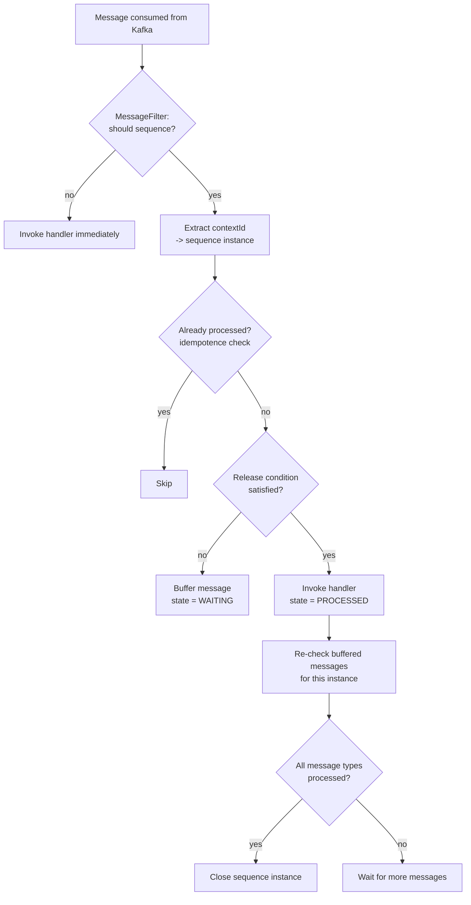

# How sequencing works

The Sequential Inbox consumes Kafka messages itself (not your `@KafkaListener`) and decides, per
message, whether to release it to your handler immediately or to buffer it until its predecessors
have been processed.

## Core concepts

| Concept              | Meaning                                                                                                         |
|----------------------|----------------------------------------------------------------------------------------------------------------|
| Sequence             | A named group of message types that must be processed in a defined order, with a `retentionPeriod`             |
| `contextId`          | The value (extracted by a `ContextIdExtractor`) that groups messages into one sequence *instance*              |
| Sequence instance    | One concrete run of a sequence for a given `contextId` (e.g. one order); rows in `sequence_instance`           |
| Release condition    | The predecessor message(s) that must be processed before a message is released (`predecessor` / `and` / `or`)  |
| Buffered message     | A consumed message whose release condition is not yet satisfied; stored in `buffered_message`                  |
| Sequenced message    | A per-instance record of a message and its state (`WAITING`, `PROCESSED`, `FAILED`); rows in `sequenced_message` |

## Processing flow

When a message arrives, the inbox resolves its qualified type name (`type` plus optional `.subType`),
finds the matching `SequencedMessageType`, and applies the configured `MessageFilter`. If the filter
says the message should not be sequenced (or no `contextId` can be extracted), it is handled
immediately. Otherwise the sequence instance for the `contextId` is created or loaded, and the
message is either released (its release condition is satisfied) or buffered. After handling a
message, buffered messages whose conditions are now satisfied are released in turn. When every
message type of the sequence has been processed, the instance is closed.

## Failure handling and idempotence

If a handler throws, the message is marked `FAILED` and the exception is re-thrown so the underlying
`jeap-messaging` error handler can send a `MessageProcessingFailedEvent` to the error-handling
service. Messages already in state `WAITING` or `PROCESSED` are skipped on redelivery, so processing
is idempotent on the message's idempotence id.

## Recording mode (migrating a live topic)

`jeap.messaging.sequential-inbox.sequencing-start-timestamp` enables a migration mode: until the
configured timestamp is reached, predecessor messages are processed immediately and only *recorded*
as processed, so that successors received after activation still see their predecessors as done. This
allows introducing a sequence on a topic whose predecessor messages were emitted before the sequence
existed.

## Related

- [Getting started](getting-started.md)
- [Sequence declaration reference](sequence-declaration.md)
- [DevOps operations](devops-operations.md)
- [jeap-messaging-sequential-inbox](../README.md)
