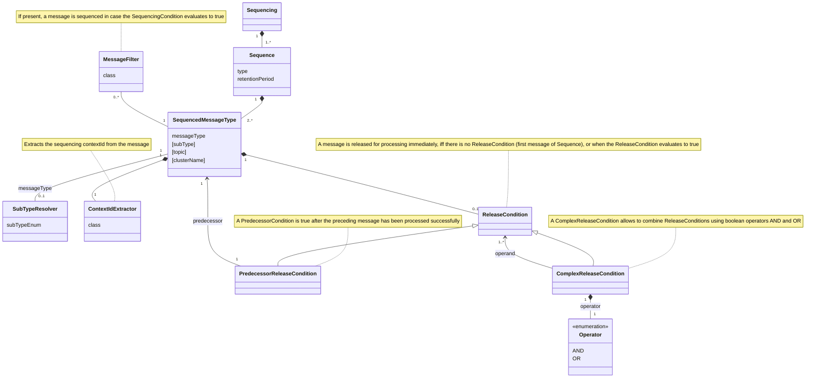

# Sequence declaration reference

Sequencing is declared in a YAML descriptor, by default loaded from
`classpath:/messaging/jeap-sequential-inbox.yml` (override with
`jeap.messaging.sequential-inbox.config-location`). The file has two top-level keys: an optional
`subTypeResolvers` map and a list of `sequences`.

## Data model



## Sequence

| Attribute         | Cardinality | Description                                                                                     | Example         |
|-------------------|-------------|-------------------------------------------------------------------------------------------------|-----------------|
| `name`            | Required    | Name of the sequence (used in logs, the REST API and the sequence instance rows)                | `OrderSequence` |
| `retentionPeriod` | Required    | How long a sequence instance is retained, as a `Duration`; drives expiry and housekeeping       | `24h`           |
| `messages`        | Required    | The list of `SequencedMessageType` entries that belong to the sequence                          |                 |

## SequencedMessageType

| Attribute            | Cardinality | Description                                                                                                                                                 | Example                                        |
|----------------------|-------------|-------------------------------------------------------------------------------------------------------------------------------------------------------------|------------------------------------------------|
| `type`               | Required    | The jEAP message type name (the Avro message simple class name)                                                                                             | `JmeOrderCreatedEvent`                         |
| `subType`            | Optional    | Subtype for fine-grained sequencing of a generic message type. Resolved by a `SubTypeResolver`; must be a value of the resolver's Java `Enum`               | `STOCK_AVAILABLE`                              |
| `topic`              | Optional    | Topic to consume the message from, if different from the default                                                                                            | `my-topic`                                     |
| `clusterName`        | Optional    | Kafka cluster of the topic, if different from the default cluster                                                                                           | `aws`                                          |
| `contextIdExtractor` | Required    | Fully-qualified class name implementing `ContextIdExtractor`; returns the `contextId` grouping messages into one instance (`null` = not sequenceable)       | `ch.admin.bit.example.OrderIdExtractor`        |
| `messageFilter`      | Optional    | Fully-qualified class name implementing `MessageFilter`; `shouldSequence` returning `false` means the message bypasses the inbox and is handled immediately | `ch.admin.bit.example.OrderCreatedEventFilter` |
| `releaseCondition`   | Optional    | The predecessor(s) that must be processed before this message is released. No condition means the message can be released as soon as it arrives             |                                                |

## ContextIdExtractor

A `ContextIdExtractor` is required for every message type in the sequence declaration. It extracts
the `contextId` from an incoming message — all messages with the same `contextId` are grouped into
one sequence instance (e.g. all messages for the same order). Returning `null` means the message
cannot be sequenced and is handled immediately.

Implement `ContextIdExtractor<YourMessageType>` and reference the fully-qualified class name in
`contextIdExtractor`:

```java
public class ProcessIdExtractor implements ContextIdExtractor<AvroMessage> {

    @Override
    public String extractContextId(AvroMessage message) {
        return message.getOptionalProcessId().orElse(null);
    }
}
```

## MessageFilter

A `MessageFilter` is optional. When configured, `shouldSequence` is called for each incoming
message: returning `false` means the message **bypasses** the inbox and is handled immediately — it
is not ignored, just not sequenced. Returning `true` (or having no filter) means the message follows
the normal sequencing path.

Implement `MessageFilter<YourMessageType>` and reference the fully-qualified class name in
`messageFilter`:

```java
public class OrderCreatedEventFilter implements MessageFilter<JmeOrderCreatedEvent> {

    @Override
    public boolean shouldSequence(JmeOrderCreatedEvent message) {
        return !"NOT_SEQUENCED".equals(message.getPayload().getOrderType());
    }
}
```

## Release conditions

A release condition references predecessors by their qualified name (`type`, or
`type.subType` when a subtype is used). Conditions can be nested with `and` and `or`.

```yaml
# single predecessor
releaseCondition:
  predecessor: JmeOrderCreatedEvent

# all of several predecessors
releaseCondition:
  and:
    - predecessor: JmeOrderValidatedEvent.STOCK_AVAILABLE
    - predecessor: JmeOrderValidatedEvent.CUSTOMER_CREDIT_CHECKED
    - predecessor: JmeOrderPreparedEvent

# any one of several predecessors
releaseCondition:
  or:
    - predecessor: JmeOrderShippedEvent
    - predecessor: JmeOrderOtherEvent
```

## SubTypeResolver

When one Avro message type represents several business events, a `SubTypeResolver` adds a subtype to
the message type name (`<MessageType>.<SubType>`), enabling fine-grained sequencing. The resolver
returns an `Enum` value — never `null`.

The following constraints are validated on startup:

- Must implement `SubTypeResolver<YourAvroMessage, YourSubtypeEnum>`
- All enum values must be declared as a `subType` in the sequence declaration
- All `subType` values in the declaration must be valid enum values
- A message type configured with a subtype cannot also be configured without a subtype
- Different subtypes of the same message type cannot have inconsistent topic configurations

Implement `SubTypeResolver<YourMessageType, YourEnum>` and register it in `subTypeResolvers`:

```yaml
subTypeResolvers:
  JmeOrderValidatedEvent: ch.admin.bit.example.OrderValidatedEventSubTypeResolver
```

```java
public class OrderValidatedEventSubTypeResolver
        implements SubTypeResolver<JmeOrderValidatedEvent, ValidationType> {

    @Override
    public ValidationType resolveSubType(JmeOrderValidatedEvent event) {
        return event.getPayload().getValidationType();
    }
}
```

## Full example

```yaml
subTypeResolvers:
  JmeOrderValidatedEvent: ch.admin.bit.example.OrderValidatedEventSubTypeResolver

sequences:
  - name: OrderSequence
    retentionPeriod: 24h
    messages:
      - type: JmeOrderCreatedEvent
        contextIdExtractor: ch.admin.bit.example.OrderIdExtractor
        messageFilter: ch.admin.bit.example.OrderCreatedEventFilter
        topic: my-custom-topic        # optional: override default topic
        clusterName: my-custom-cluster  # optional: override default cluster

      - type: JmeOrderValidatedEvent
        subType: STOCK_AVAILABLE
        contextIdExtractor: ch.admin.bit.example.OrderIdExtractor
        releaseCondition:
          predecessor: JmeOrderCreatedEvent

      - type: JmeOrderValidatedEvent
        subType: CUSTOMER_CREDIT_CHECKED
        contextIdExtractor: ch.admin.bit.example.OrderIdExtractor
        releaseCondition:
          predecessor: JmeOrderCreatedEvent

      - type: JmeOrderPreparedEvent
        contextIdExtractor: ch.admin.bit.example.OrderIdExtractor
        releaseCondition:
          predecessor: JmeOrderCreatedEvent

      - type: JmeOrderShippedEvent
        contextIdExtractor: ch.admin.bit.example.OrderIdExtractor
        releaseCondition:
          and:                                              # all predecessors must be processed
            - predecessor: JmeOrderValidatedEvent.STOCK_AVAILABLE
            - predecessor: JmeOrderValidatedEvent.CUSTOMER_CREDIT_CHECKED
            - predecessor: JmeOrderPreparedEvent

      - type: JmeOrderCustomEvent
        contextIdExtractor: ch.admin.bit.example.OrderIdExtractor
        releaseCondition:
          or:                                              # any one predecessor is sufficient
            - predecessor: JmeOrderShippedEvent
            - predecessor: JmeOrderOtherEvent
```

## Related

- [Getting started](getting-started.md)
- [How sequencing works](how-it-works.md)
- [Configuration reference](configuration.md)
- [jeap-messaging-sequential-inbox](../README.md)
